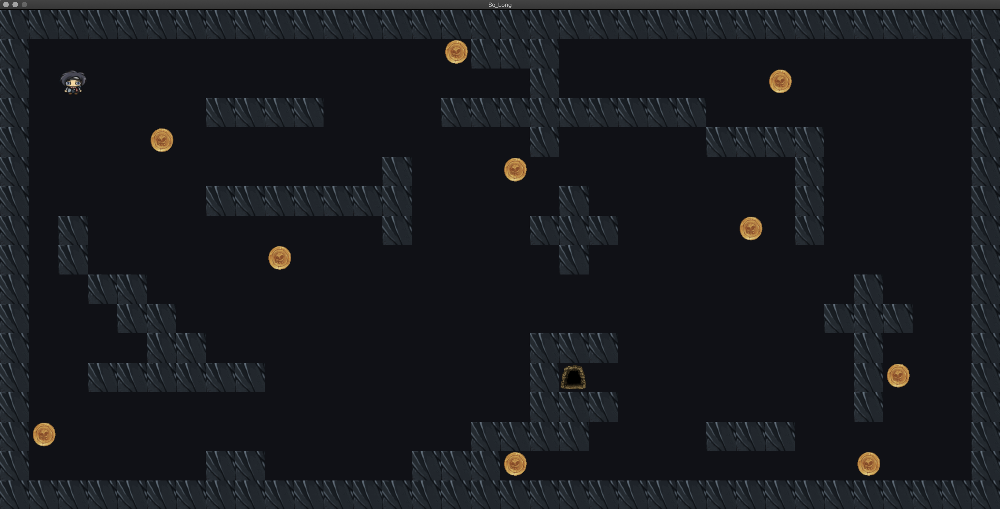

# So_long

<strong>2D Game Project.</strong>

```diff
+IN GAME IMAGE+
```  
<a></a>

Site i use to remove image background
```diff
https://www.slazzer.com/
```
The site I use for 64X64 pixel conversion
```diff
https://convert-my-image.com/
```
The site I used to convert the .png file to the .xpm file
```diff
https://miconv.com/
```

### HOW TO PLAY
The player’s goal is to collect all collectibles present on the map then escape with minimal movement.

|KEYBOARD|ACTION|
|---|---|
|`W`|Move up|
|`S`|Move down|
|`A`|Move left|
|`D`|Move right|
|`ESC`|Close the game window|
